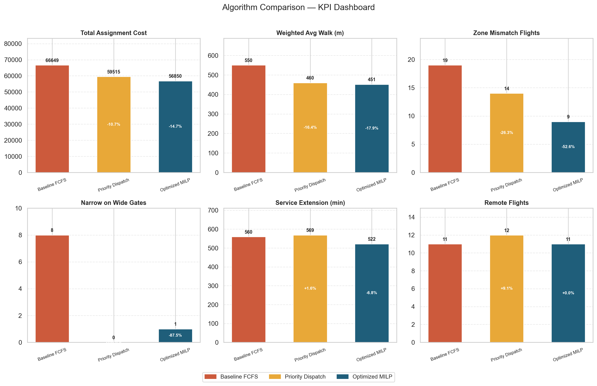
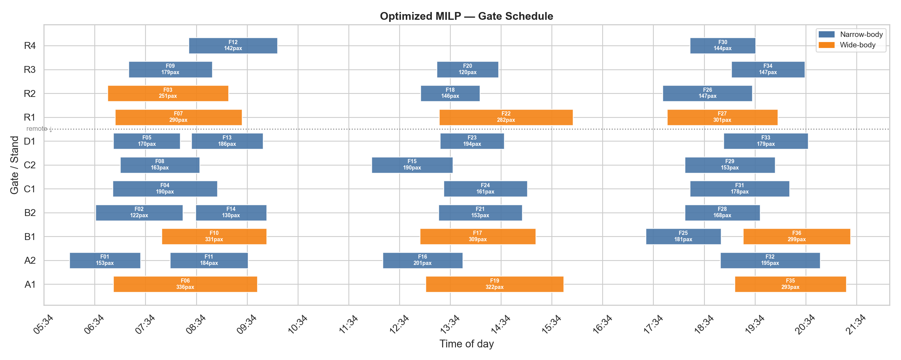

# Airport Turnaround Capacity and Gate Allocation

**A Case Study on Tirana International Airport**

[](https://airport-gate-assignment-optimization.onrender.com)
[](LICENSE)

🚀 **Live dashboard:** <https://airport-gate-assignment-optimization.onrender.com>
*(free tier — the first visit may take ~30 s to wake the server)*

A decision-support framework that models airport **gate (stand) assignment** as a
capacity-allocation problem and compares three policies — a first-come-first-served
baseline, a passenger-priority heuristic, and a mathematically optimal MILP — across
cost, passenger walking distance, terminal-zone fit, and robustness to delays.

It ships with an interactive **Plotly Dash** dashboard so the results can be explored
in the browser — including a **"Bring Your Own Airport"** tab where you can download an
Excel template, upload your own flight and gate tables (`.xlsx` or `.csv`), and re-run
the full optimization for any airport.

---

## What it does

| Policy | Idea |
| --- | --- |
| **Baseline FCFS** | Process flights in arrival order, take the first feasible gate (greedy). |
| **Priority Dispatch** | Highest-passenger flights pick their best gate first (heuristic). |
| **Optimized MILP** | Mixed-integer program (PuLP + CBC): minimise total assignment cost subject to one-gate-per-flight and no time overlaps. |

On top of the three policies the pipeline runs:

- **Sensitivity analysis** — sweeps each cost weight and re-solves the MILP.
- **Robustness simulation** — 100 random delay scenarios, comparing how each policy degrades.
- **Scenario analysis** — normal / heavy / disruption operating days.

## Headline results (synthetic case)

Compared with the FCFS baseline, the optimized MILP:

- **−14.7%** total assignment cost
- **−18.0%** weighted average passenger walking distance
- **−52.6%** terminal-zone mismatches
- the **heavy-traffic** scenario becomes *infeasible* under the current stand inventory —
  a structural capacity limit, not a tuning artefact.

| Policy | Total cost | Avg walk (m) | Zone mismatches | Remote flights |
| --- | --- | --- | --- | --- |
| Baseline FCFS | 66,649 | 550.2 | 19 | 11 |
| Priority Dispatch | 59,515 | 459.9 | 14 | 12 |
| Optimized MILP | **56,850** | **451.4** | **9** | 11 |




---

## Quick start (local)

```bash
python -m venv venv
# Windows:  venv\Scripts\activate
# macOS/Linux:  source venv/bin/activate

pip install -r requirements.txt

# 1) Regenerate all data, KPIs, figures, simulation & scenario outputs
python src/run_project.py

# 2) Launch the interactive dashboard → http://127.0.0.1:8050
python src/dashboard.py
```

The dashboard loads precomputed results from `data/processed/` and `outputs/` for an
instant start; if those files are missing it computes everything live on first run.

## Deploy

This repo is ready to deploy as a web app on **Render** (`render.yaml` + `Procfile`)
or **Hugging Face Spaces** (`Dockerfile`). Step-by-step instructions for both are in
**[DEPLOY.md](DEPLOY.md)**.

## Project structure

```
src/
  project_data.py     synthetic flight & gate generator (seeded)
  project_model.py    cost model, compatibility, FCFS / Priority / MILP solvers
  sensitivity.py      cost-weight parameter sweeps
  simulation.py       100-scenario stochastic robustness study
  project_visuals.py  matplotlib figures
  dashboard.py        Plotly Dash app (4 tabs)
  run_project.py      one-command pipeline → CSVs + figures + summary
data/processed/       generated flight/gate/assignment CSVs
outputs/              KPI tables, simulation/scenario/sensitivity CSVs, figures
```

## Methodology in one paragraph

Each (flight, gate) pair gets a cost combining passenger-weighted walking distance,
taxi penalty, a flat remote-stand penalty, a terminal-zone-mismatch penalty, and a
gate-scarcity penalty (narrow body on a wide-body contact gate). Compatibility enforces
aircraft size and international capability. The MILP minimises total cost with binary
assignment variables, an exactly-one-gate constraint per flight, and pairwise no-overlap
constraints for time-conflicting flights, solved with CBC via PuLP.

## License

[MIT](LICENSE) © 2026 Yusuf Kılıç
